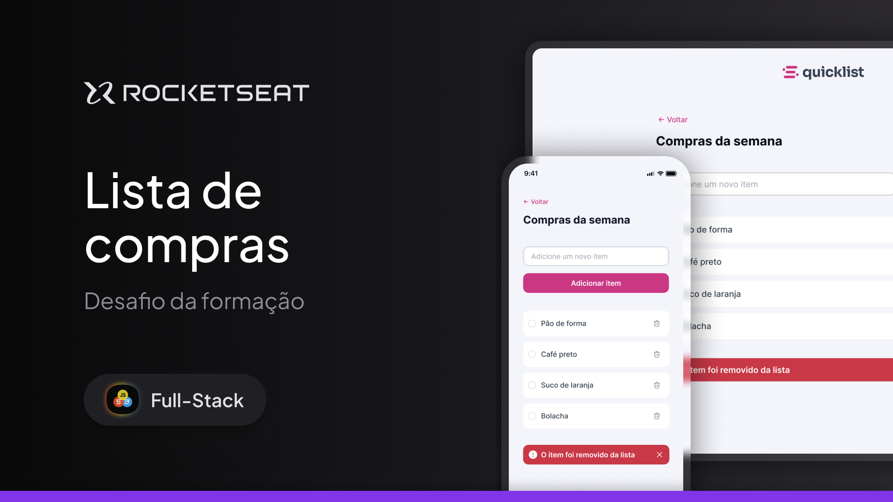

  <h1>🛍️ Lista de Compras</h1>

  

    Projeto desenvolvido como desafio do curso Fullstack da Rockeseat, onde o foco foi praticar 
    <strong>JavaScript</strong> com manipulação da DOM, funções e eventos.
    A interface foi disponibilizada através de um modelo no Figma.
  

  
  <h2>🚀 Como usar</h2>
  <ol>
    <li>Clone o repositório:</li>
    <pre><code>git clone https://github.com/seu-usuario/shopping-list.git</pre></code>
    <li>Abra o arquivo <code>index.html</code> em seu navegador:</li>
    <pre><code>cd shopping-list && open index.html</code></pre>
  </ol>

  <h2>📈 Melhorias Futuras</h2>
  <ul>
    <li>✅ Armazenamento permanente com <code>localStorage</code></li>
    <li>🔍 Filtro e busca de itens</li>
    <li>✏️ Edição de itens</li>
    <li>☁️ Integração com back-end para persistência real</li>
  </ul>
  <h2>🛠️ Tecnologias utilizadas</h2>
  

    
    
    
    
    
  

  
<small>Thank you for reading! ❤️</small>

